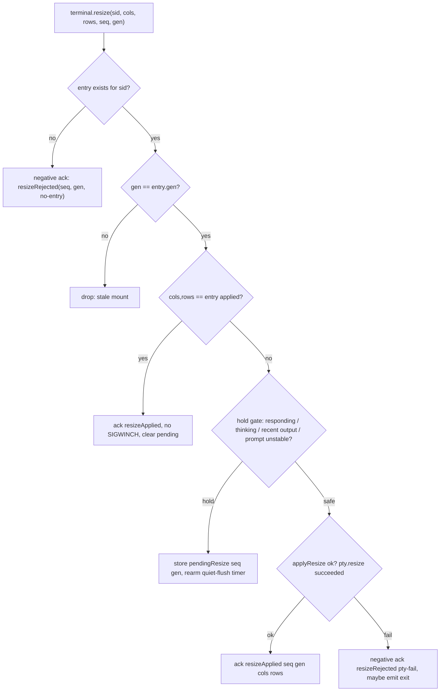
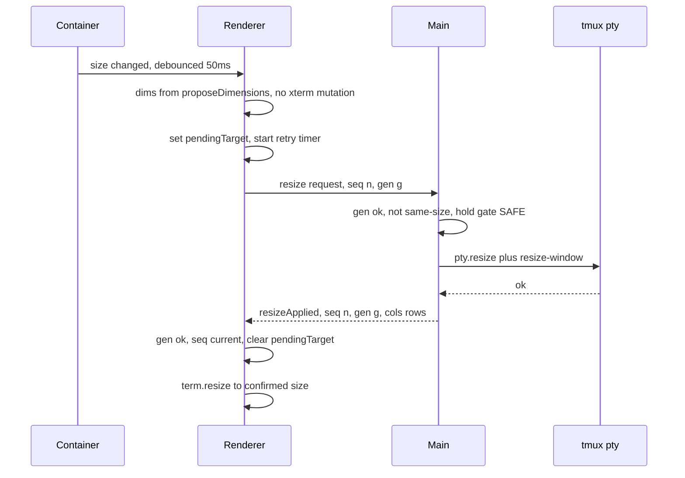
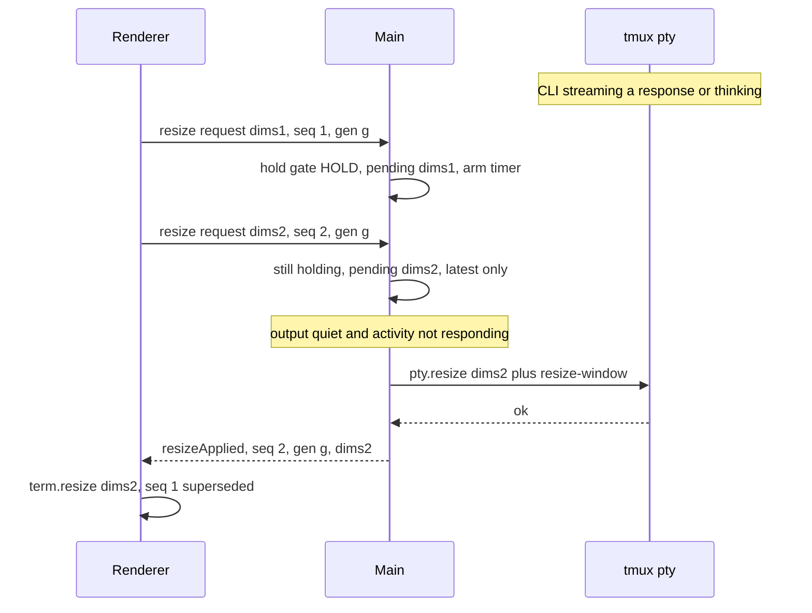
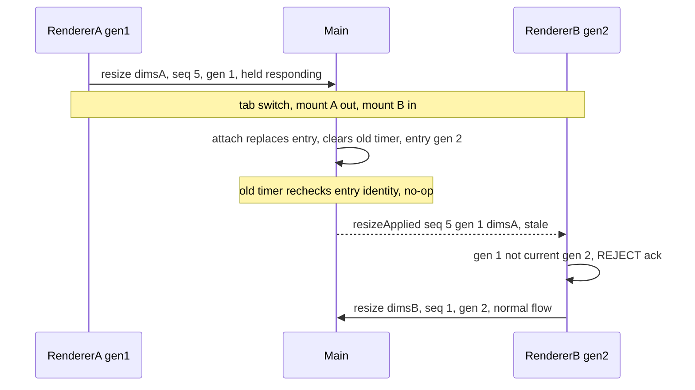
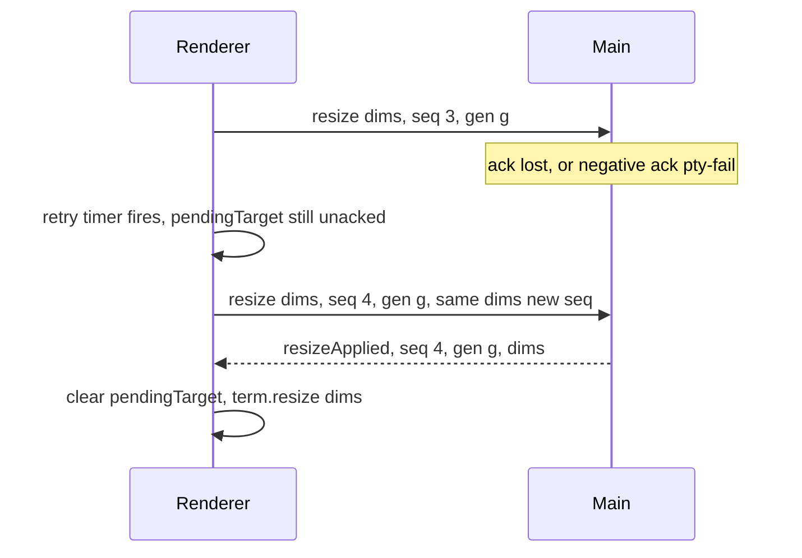
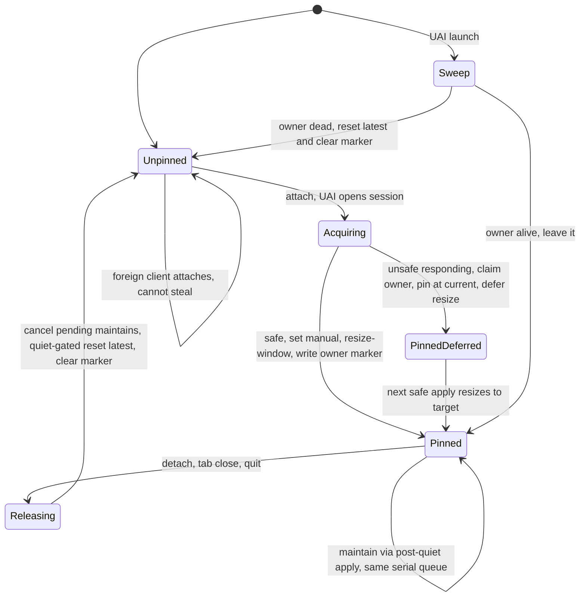
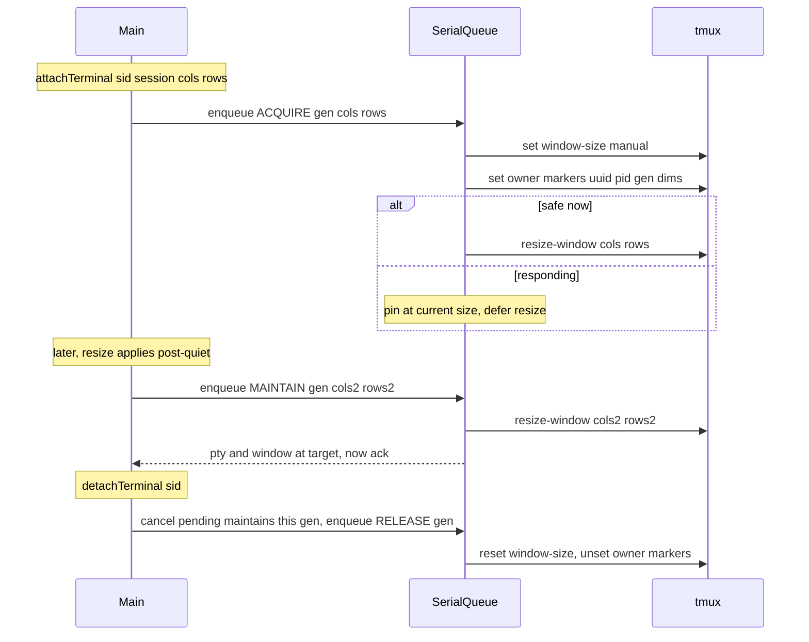

# UAI Terminal Geometry — Design (② resize transaction + ① window-pin lease)

**Status:** ⏸️ **SHELVED (2026-07-12)** — superseded by a step-back decision. PianoMan judged the
whole-turn resize hold (from `3c46c24c2`, the ancestor of ②/①) an unacceptable UX cost (a >10s
hold on any mid-response resize), and today's iTerm-shows-same evidence showed much of the
corruption it targeted is Claude Code's OWN scrollback redraw (CC v2.1.201), which deferring
can't fix. We reverted `terminal.ts` to the June **immediate-resize baseline** (v1.3.282) and
are monitoring whether "June-solid Memorex" returns. This design (and the ① lease) is preserved
for reference but is NOT being built unless the baseline proves the hold was actually load-
bearing. See todo_0504.

---

**Original status:** DESIGN — for PianoMan + Codex review. Encodes the *corrected* design after Codex
Review 2 (`$AI_ROOT/ai_general/work/projects/uai_app/unified_ai_interface/docs/designs/uai_terminal_geometry.review2_codex.md`).
Supersedes the shipped v1.3.280 ② (held, not fleet-safe) and the first ① lease draft
(`$AI_ROOT/ai_general/work/projects/uai_app/unified_ai_interface/docs/designs/uai_terminal_window_pin_lease.md`,
changes-requested). NOTHING here is implemented yet. Related: todo_0504.

The diagrams are Mermaid (control-flow / sequence / state) and are **validated with `mmdc`**
(mermaid-cli) so they render. Each has a prose walkthrough so it reviews even unrendered. Say
the word and I'll also render a visual companion.

## Terms

- **sid** — the UAI **sessionId**: the session identifier passed on every terminal IPC
  (`terminal.resize(sid, …)`). It keys the pty entry in the main process.
- **seq** — a per-mount monotonic **request number** the renderer stamps on each resize, so an
  ack can be matched to a request.
- **gen (generation token)** — a monotonic id minted per **mount/attach**. Every resize
  *request* and *ack* carries it. Acks whose gen ≠ the current mount's gen are rejected. This
  is what makes stale cross-mount acks safe (Codex #7/#10). `sid + seq` alone is insufficient
  because `seq` resets each mount.
- **② resize transaction** — the renderer↔main protocol that keeps xterm's grid in lockstep
  with the pty/tmux paint size. The renderer never reflows xterm on its own.
- **① window-pin lease** — a *lease* UAI holds on a tmux session's `window-size` while it
  drives that session, so a foreign client can't drag the window off UAI's size. Released
  (back to `latest`) when UAI stops driving it.
- **hold gate** — the safety predicate deciding whether a resize may be applied *now*. A resize
  (SIGWINCH / tmux repaint) mid-response corrupts scrollback, so we hold while the CLI is
  **responding OR thinking OR emitting output OR the prompt isn't stable** — not merely "recent
  output" (Codex #9; this is the missed "thinking, no output" repro).
- **owner marker** — tmux user-options on a leased session recording who holds the lease:
  `@uai_pin_owner` (app uuid+pid), `@uai_pin_gen`, `@uai_pin_dims`, `@uai_pin_at`. Lets a
  startup sweep clear only UAI-owned *stale* leases, never a blanket reset (Codex #15).

## Design principles (the invariants the diagrams must preserve)

1. **xterm never leads tmux.** The renderer resizes xterm only after main confirms the pty
   (and, under ①, the tmux window) is actually at that size — via an ack.
2. **Every request resolves.** A request is applied, held-then-applied, or rejected — and a
   lost/failed one is retried by a pending-target timer. xterm can never freeze because an ack
   went missing (Codex #6).
3. **Never resize mid-response.** Both the ② apply and the ① `resize-window` ride the same hold
   gate. No independent resize from the request path (Codex #9/#14/#16).
4. **Generation-scoped.** Anything crossing the renderer↔main boundary (request, ack, held
   flush) is stamped with `gen`; stale-gen messages are dropped (Codex #7/#10).
5. **The lease is owner-marked, serialized, and self-restoring.** One serialized op queue per
   session; ack only after *both* pty and tmux are at target; release cancels pending maintains
   first; startup clears only UAI-owned dead-owner leases (Codex #13/#14/#15).

---

## ② The resize transaction

### 2.1 Main-process decision (flowchart)

**Walkthrough.** A resize request is dropped only if it's from a stale mount (gen mismatch).
Same-size is acked immediately with no SIGWINCH (so the renderer still syncs) and cancels any
pending resize ("resize back" cancellation). Otherwise the hold gate decides: hold (store the
*latest* pending, rearm the quiet timer) or apply. Apply acks **only if the pty resize actually
succeeded**; on failure it sends a *negative* ack so the renderer can retry or await a remount —
it never silently leaves xterm mismatched (Codex #6/#8).

### 2.2 Happy path — quiet resize (sequence)

### 2.3 Held resize during a response (sequence)

**Note:** the renderer's retry timer is keyed to *pendingTarget*, not to a specific seq — so
when seq 2 supersedes seq 1 (pendingTarget updated to dims2) it stops retrying dims1.

### 2.4 Stale cross-mount ack rejected (sequence) — Codex #7

**Walkthrough.** On remount, main clears the previous entry's `quietTimer` and stamps the new
entry with a fresh `gen`. `armQuietFlush` also re-checks `ptyEntries.get(sid) === entry` before
applying/acking, so a stale timer can't act on the wrong entry. Any late ack from the old
generation is rejected by the renderer's gen check (Codex #7/#10).

### 2.5 Lost/failed ack recovery (sequence) — Codex #6

**Key rule:** the renderer must **not** suppress a same-dimension re-request while a target is
still unacked. (The shipped v1.3.280 advances `lastReq` on send and suppresses same-dims → the
stuck-xterm bug.) Dedup is against the *last CONFIRMED* size, not the last *sent* size.

---

## ① The window-pin lease

### 3.1 Lease lifecycle (state diagram)

**Walkthrough.** Acquire is **safety-gated**: if the session is responding at attach, UAI still
claims ownership (writes the marker) but pins at the *current* window size and defers the resize
to the next safe moment — it never fires a `resize-window` mid-response (Codex #16). Maintain
rides ②'s post-quiet apply on the same serialized queue (never the request path). Release cancels
any pending maintain first, then — quiet-gated — resets to `latest` and clears the marker.
Startup sweeps only sessions whose owner marker points at a **dead** owner (Codex #15); a live
owner (another UAI window/instance) is left alone.

### 3.2 Acquire / maintain / release coupled to ② (sequence)

**Critical ordering (Codex #13):** the queue is **serialized per session** and **generation-
checked** — a MAINTAIN tagged with an older gen than the latest RELEASE is dropped, so a late
maintain can never re-pin after release. The ② ack for a resize is emitted **only after both the
pty resize and the `resize-window` have completed** — never before tmux is at target (no
fire-and-forget).

---

## Worked examples (map to Codex's 10-scenario live test)

| # | Scenario | Expected behavior |
|---|----------|-------------------|
| 1 | **Quiet resize** (drag Prompt Box while terminal idle) | Applies immediately (§2.2); xterm reflows on ack; geometry shows window == xterm. |
| 2 | **Streaming resize** (resize during a response) | Held; latest-only; no xterm reflow until output settles, then snaps (§2.3). No scrollback corruption. |
| 3 | **Thinking, no output, resize** (toggle a panel while Claude "thinks" silently) | **Held** by the activity-state gate even though no PTY bytes flow (Codex #9 — the repro v1.3.280 misses). |
| 4 | **Tab remount with a pending held resize** | Old gen's late ack is rejected; new mount runs clean (§2.4). No stuck/mis-sized xterm. |
| 5 | **PTY exit while a resize is pending** | Negative ack (`pty-fail`) → renderer doesn't resize a dead terminal; exit surfaced (§2.1). |
| 6 | **UAI crash, then restart** | Startup sweep finds the session's `@uai_pin_owner`; owner pid dead → resets `latest`, clears marker (§3.1). Self-heals. |
| 7 | **Foreign iTerm attaches at a taller size while lease active** | `manual` ignores it → window stays at UAI's size; iTerm sees it letterboxed. On UAI detach, `latest` resumes and iTerm drives it. |
| 8 | **Rapid repeated resizes / resize-back-to-original while held** | Only the latest pending applies; a resize back to the applied size is a same-size ack that cancels the pending (§2.1). |
| 9 | **Same-size no-op** | Acked with no SIGWINCH; xterm synced; no repaint. |
| 10 | **StandaloneTerminal (raw shell) resize** | Unchanged — immediate fit; no lease, no ack transaction (no SIGWINCH/dot-marker failure mode). |

## Diagnostic surface (required before the live test — Codex #12)

Expose via CDP / an `uai:terminal:geometryState` query, per session:
`{ xtermCols, xtermRows, appliedPtyCols, appliedPtyRows, pendingTarget, lastReqSeq,
lastAckedSeq, gen, holdReason, activityState, leaseOwner, leaseGen, windowSize }`.
A passing *visual* test can otherwise hide a still-mismatched tmux/window state.

## Open review points

1. **Where does `activity_state` come from inside `terminal.ts`?** The status layer computes
   responding/thinking elsewhere. Options: (a) main reads it from the session store / status
   IPC; (b) the renderer passes its known activity_state on the resize request. Needs a source
   decision — flagged for review.
2. **Serialized queue implementation** — a per-session promise chain in main, or a small state
   machine? Must survive attach-replace (carry/cancel by gen).
3. **`resize-window` cost** — if the per-op `session_ops.py` spawn (~100–300ms) is too slow for
   maintain, do we want a persistent substrate helper? (Correctness first: the ack waits for it.)
4. **`PinnedDeferred` visibility** — while deferred (responding at attach), xterm is at the
   target but the tmux window is at the old size until the next safe apply. Is a transient
   letterbox acceptable, or do we block xterm too until the window catches up?
